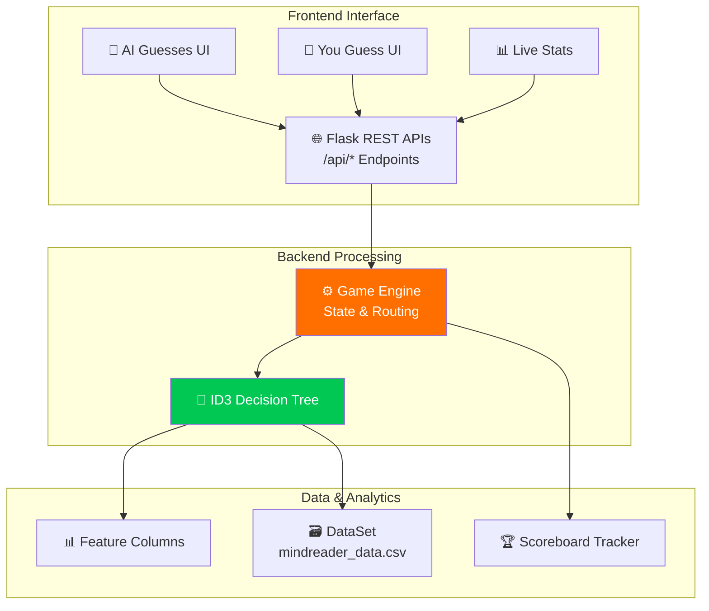

<div align="center">
  
  <h1>🧠 Mind Reader AI</h1>
  <p><strong>A Next-Generation Machine Learning Game that actually reads your mind.</strong></p>
  <p>
    <a href="#-features">Features</a> •
    <a href="#-system-architecture">Architecture</a> •
    <a href="#-installation--running-locally">Installation</a> •
    <a href="#-how-it-works">How It Works</a> •
    <a href="#-models--accuracy">Machine Learning Models</a>
  </p>
</div>

---

## 🎮 The Experience

Mind Reader is a full-stack, AI-powered web game where you compete against a custom-trained **ID3 Decision Tree**. 

The game features two distinct modes:

| Mode | Emoji | Description | Visual UI |
|----------|-------|---------------|----------|
| **AI Guesses** | 🤖 | You think of an object. The AI asks YES/NO questions. | 🟩 **Dynamic Confidence Meter & Live Candidate Filtering** |
| **You Guess** | 🎯 | The AI picks an object. You type YES/NO questions. | 🟦 **Holographic Chat Terminal & Hint Generation** |

---

## ✨ Features

- ⚡ **Dynamic Entropy Questions:** The AI dynamically recalculates information gain after every answer you provide to ask mathematically optimal questions.
- 🎯 **Visual Confidence Meter:** Watch the AI's certainty percentage increase as you answer, fully exposing backend probabilities.
- 👀 **Live Candidate Elimination:** As you answer questions, incorrect items disappear instantly natively through Svelte components.
- 🎨 **Glassmorphic Cyber UI:** Premium Svelte 4 frontend featuring layered mesh gradients, glass panels, reactive candidate chips, and slick routing micro-animations.

---

## 🏗 System Architecture



---

## 🚀 Installation & Running Locally

The project is structured elegantly into fully-decoupled `frontend/` and `backend/` architectures.

### Prerequisites
- Python 3.9+
- Node.js & npm

### 1. Start the Machine Learning API (Backend)
Open a terminal in the repository root and navigate:
```bash
cd backend
pip install -r requirements.txt
python app.py
```
*The Flask server will boot on `http://127.0.0.1:5000`, loading pre-trained Scikit-Learn logic.*

### 2. Start the Game Engine UI (Frontend)
Open a **new** terminal in the repository root:
```bash
cd frontend
npm install
npm run dev
```
*Navigate to your local Vite host (e.g. `http://localhost:5173`) to play immediately!*

---

## 📂 Project Structure

```
Mind-Reader/
├── frontend/                     # 🌐 Svelte 4 Application
│   ├── src/
│   │   ├── pages/
│   │   │   ├── Home.svelte       # Mode selections & Matrix Canvas
│   │   │   ├── AIGuesses.svelte  # Model classification interface
│   │   │   ├── UserGuesses.svelte# Custom chat client wrapper
│   │   │   └── Stats.svelte      # Data-viz dashboards
│   │   ├── lib/api.js            # Axios/Fetch backend wrapper
│   │   ├── app.css               # Global glassmorphism styles
│   │   └── App.svelte            # Routing
│   ├── package.json
│   └── vite.config.js            # Proxy configuration pointing to :5000
│
├── backend/                      # ⚙️ Flask & ML Engine
│   ├── app.py                    # REST API declarations
│   ├── game_engine.py            # Core logic, entropy checks, and state
│   └── data/
│       └── mindreader_data.csv   # The 189 row target dataset
│
├── models/                       # 🧠 Trained Data
│   ├── modelcolab/
│   │   ├── dt_model.pkl          # Serialized Decision Tree
│   │   └── label_encoders.pkl    # String <-> Binary conversions
│   └── game.ipynb                # Jupyter Notebook detailing model generation
│
└── README.md                     # This file!
```

---

## ⚙️ How It Works

### Training Pipeline Summary

```
Raw Dataset (189 entities, 40 features)
        ⬇️
Label Encoding (Categorical to integers)
        ⬇️
Model Generation (DecisionTreeClassifier, Entropy Criterion)
        ⬇️
JSON Extraction (Candidate lists and optimal features mapped)
        ⬇️
Export to JobLib/Pickle (.pkl)
```

The game relies strictly on an **ID3 Decision Tree** built on *Information Gain*. 
*(Full mathematical documentation and code is inside `models/game.ipynb`!)*

---

<div align="center">

**⭐ Star this repo if you survived the AI Mind Reader!**

</div>
